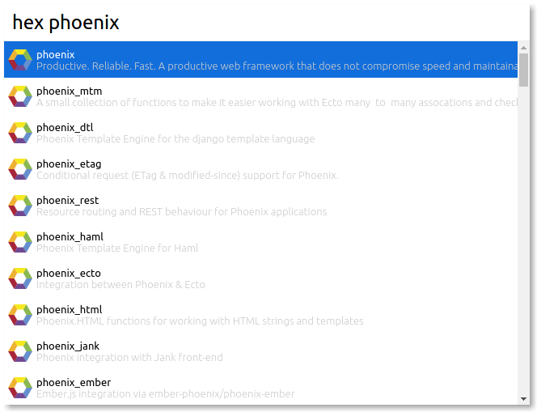

# Cerebro Hex

> A Cerebro plugin for searching hex.pm packages

## Usage

In Cerebro, type `hex packagename` to search for `packagename`

You can:

* Press Enter to open it's URL
* Press Tab to change the current input to it's URL
* Press <kbd>cmd+c</kbd> to copy it's URL to clipboard

## Related

* [Cerebro](http://github.com/KELiON/cerebro) – main repo for Cerebro app;

## License

MIT © [Lubien](http://lubien.me)
